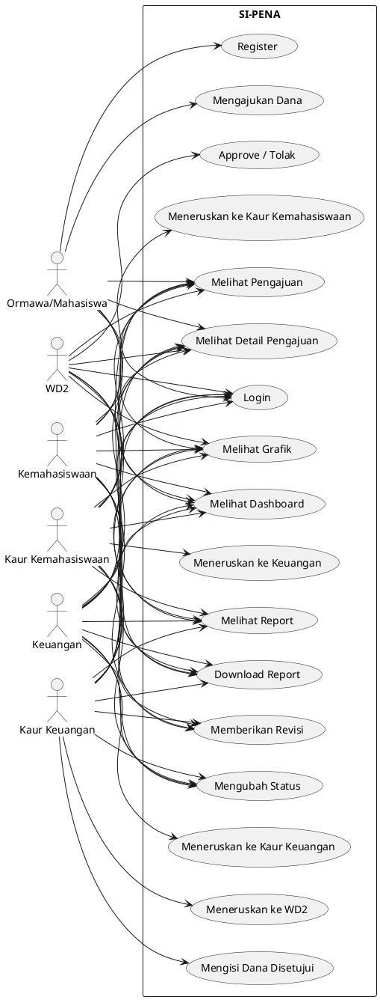
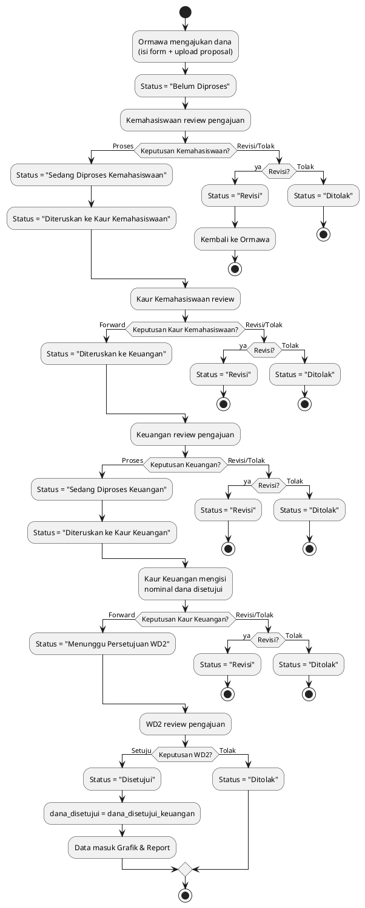
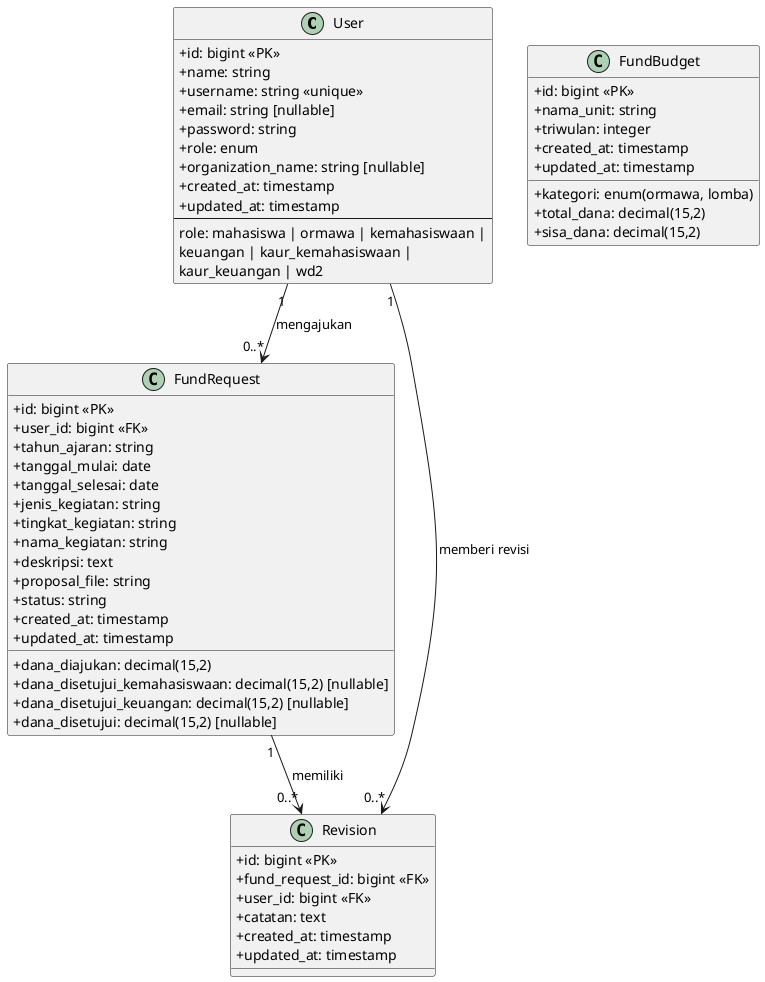
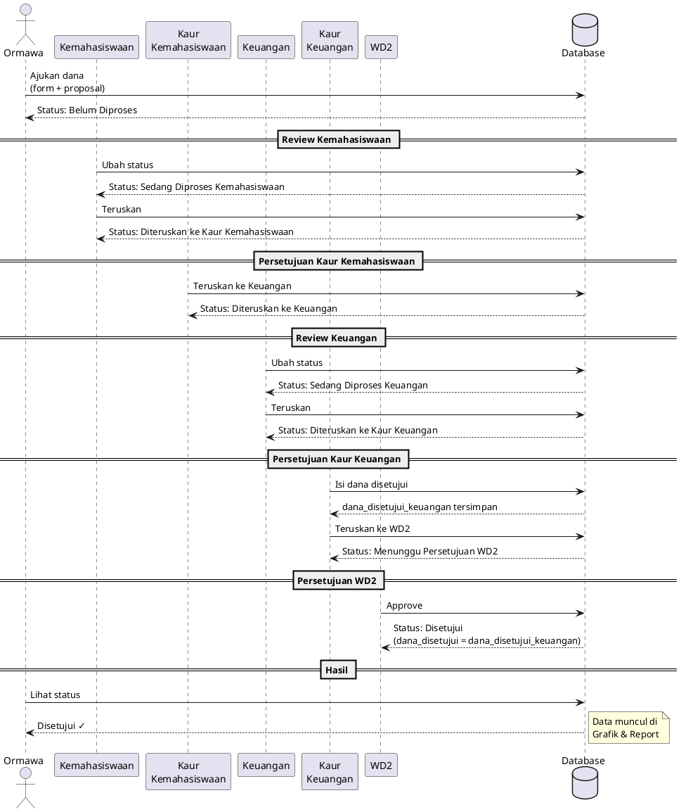
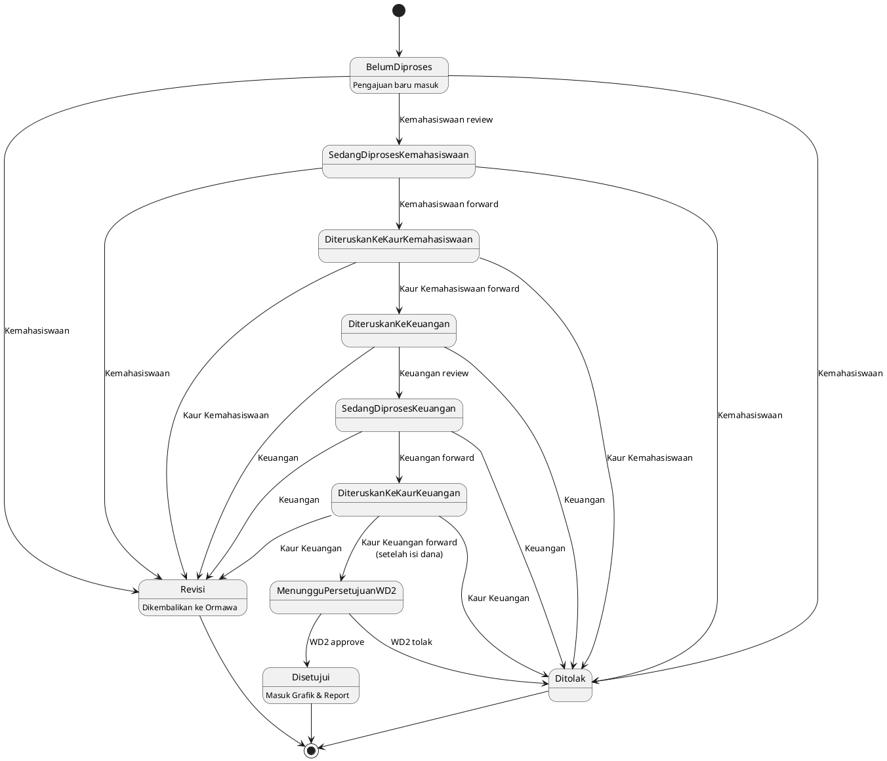

# UML Diagram SI-PENA

Semua diagram menggunakan format PlantUML. Render di https://www.plantuml.com/plantuml/uml atau plugin PlantUML di VSCode.

---

## 1. Use Case Diagram

---

## 2. Activity Diagram (Alur Pengajuan Dana)

---

## 3. Class Diagram (ERD)

---

## 4. Sequence Diagram (Pengajuan Dana Berhasil)

---

## 5. State Diagram (Status Pengajuan)

---

## Cara Render

1. **Online**: Copy isi blok `plantuml` ke https://www.plantuml.com/plantuml/uml
2. **VSCode**: Install extension "PlantUML", buka file ini, klik preview
3. **Export PNG/SVG**: Di PlantUML online, klik "Submit" lalu download gambar
